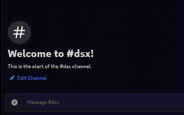

<div align="center">
  
</div>

---

> ` create interactive Discord messages with React-like components and fine-grained reactivity `

---

> [!WARNING]
> ### dsx is still in development and is slightly experimental. be weary of few breaking changes and evolving apis.

<div style="display: flex; gap: 1rem; align-items: flex-start; justify-content: center;"><div>

```tsx
import { Actions, Button, Description, Embed, Message, Title } from "dsxjs/components";
import { useSignal } from "dsxjs/hooks";
import { component, dsx, mount } from "dsxjs/renderer";
import { ButtonStyle, Client } from "discord.js";

const bot = new Client({
    intents: ["Guilds", "GuildMessages", "MessageContent"],
});

dsx(bot);

const Counter = component(() => {
    const count = useSignal(0);

    return (
        <Message>
            <Actions>
                <Button onClick={() => count.value++}>+</Button>
                <Button style={ButtonStyle.Secondary} onClick={() => count.value = 0}>{count.value}</Button>
                <Button onClick={() => count.value--}>-</Button>
            </Actions>
        </Message>
    )
})

bot.once("ready", async (b) => {
    console.log(b.user.tag);
})

bot.on("messageCreate", async (message) => {
    if (message.content === "counter") {
        // render the component into a discord message and send it
        await mount(
            Counter,
            bot,
            mounted => message.reply(mounted)
        )
    }
});

bot.login(process.env.TOKEN).catch(console.error);
```

</div>



</div>

### key features
- **reactive**: automatically updates messages depending on state
- **declarative**: build messages with jsx
- **interactive**: supports buttons, dropdowns, modals, and every other discord component
- **hooks**: use (computed) signals, effects, and other reactive hooks to manage state
- **resumable**: interactions survive bot restarts
- **lightweight**: 1 dependency, just a few kilobytes
- **flexible**: plug-and-play into any existing discord.js bot
- **modern**: first-class support for discord's "components v2" api
- **familiar**: if you know react/qwik/solid/... you'll feel right at home

### why dsx?
`dsx` lets you describe Discord UI with JSX and update it automatically through reactive state. instead of manually managing messages, components, and interactions, you write ui components that update *themselves* automatically.

### getting started

```bash
bun i dsxjs
# or:
npm install dsxjs
pnpm install dsxjs
yarn add dsxjs
```

or if you want a bot *and* dsx included (coming soon):

```bash
bun create dsxjs
# or:
npm create dsxjs
pnpm create dsxjs
yarn create dsxjs
```


### what's next?

- [getting started](./docs/quick-start.md)
- [learn dsx](./docs/learn/README.md)
- [component reference](./docs/reference/components.md)
- [hooks reference](./docs/reference/hooks.md)
- [resumability](./docs/learn/resumability.md)
- [components v2](./docs/learn/components-v2.md)
- [examples](./examples)

### roadmap & contribution
contributions, bug reports, and feature requests are welcome! See the [roadmap](./docs/ROADMAP.md) and [contributing guide](./docs/CONTRIBUTING.md) for details.

### community
find us on:
- [github discussions](https://github.com/grngxd/dsx/discussions)
- [twitter/x](https://twitter.com/grngxd)
- discord server (coming soon)

### license
`dsx` is licensed under the [MIT](./LICENSE) license.

> tldr: you're free to use and modify `dsx`, but please keep the license intact and give credit where it's due.